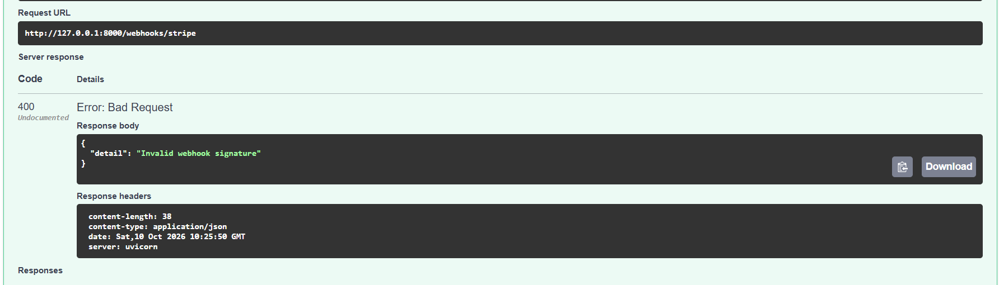
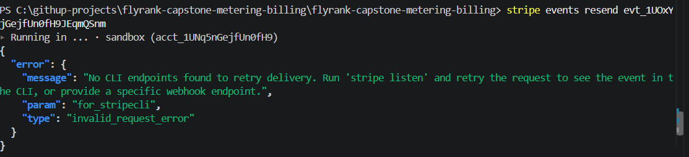
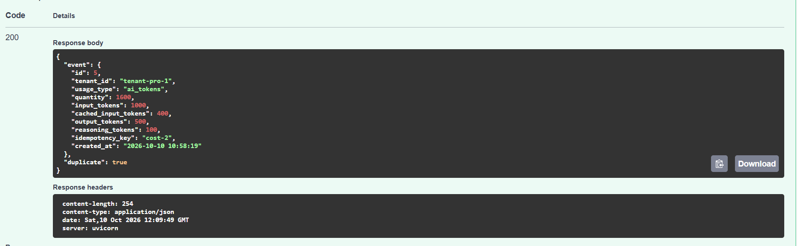
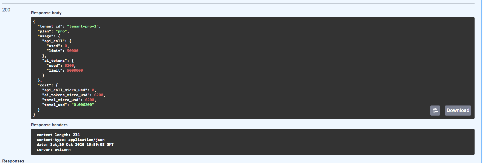

# Verification Evidence & Test Logs

This document provides technical evidence and proof of testing for the metering, billing, idempotency, and webhook security implementation.

---

## 1. Webhook Security & Signature Verification

**Component:** Stripe Webhook Endpoint (`/webhooks/stripe`)  
**Objective:** Ensure unauthenticated or improperly signed webhook payloads are rejected before processing.

### Evidence


* **HTTP Status Code:** `400 Bad Request`
* **Response Payload:**
  ```json
  {
    "detail": "Invalid webhook signature"
  }
  ```
* **Verification:** The server enforces HMAC/Stripe signature verification, preventing unauthorized third parties from forging billing events.

---

## 2. CLI Webhook Delivery Safeguard

**Component:** Stripe CLI Integration  
**Objective:** Verify webhook listener routing during event replay.

### Evidence


* **Command Executed:** `stripe events resend evt_1UOxY...`
* **Output:**
  ```json
  {
    "error": {
      "message": "No CLI endpoints found to retry delivery. Run 'stripe listen' and retry the request to see the event in the CLI, or provide a specific webhook endpoint.",
      "param": "for_stripecli",
      "type": "invalid_request_error"
    }
  }
  ```
* **Verification:** Confirms that Stripe events require an active `stripe listen` forwarding session or explicit target endpoint, ensuring events are handled deterministically in local dev environments.

---

## 3. Idempotency & Duplicate Prevention

**Component:** Request Deduplication Engine (`POST /generate`)  
**Objective:** Ensure duplicate requests sharing the same `idempotency_key` return cached results without double-charging the tenant.

### Evidence


* **HTTP Status Code:** `200 OK`
* **Response Payload:**
  ```json
  {
    "event": {
      "id": 5,
      "tenant_id": "tenant-pro-1",
      "usage_type": "ai_tokens",
      "quantity": 1600,
      "input_tokens": 1000,
      "cached_input_tokens": 400,
      "output_tokens": 500,
      "reasoning_tokens": 100,
      "idempotency_key": "cost-2",
      "created_at": "2026-10-10 10:58:19"
    },
    "duplicate": true
  }
  ```
* **Verification:** Re-submitting request with key `"cost-2"` flagged `"duplicate": true`, preserving system state and preventing double billing.

---

## 4. Integer Micro-USD Aggregation & Usage Summary

**Component:** Metering & Financial Engine (`GET /usage`)  
**Objective:** Validate dynamic integer cost calculation in micro-USD and conversion to string-formatted USD.

### Evidence


* **HTTP Status Code:** `200 OK`
* **Response Payload:**
  ```json
  {
    "tenant_id": "tenant-pro-1",
    "plan": "pro",
    "usage": {
      "api_call": {
        "used": 0,
        "limit": 50000
      },
      "ai_tokens": {
        "used": 3200,
        "limit": 5000000
      }
    },
    "cost": {
      "api_call_micro_usd": 0,
      "ai_tokens_micro_usd": 6200,
      "total_micro_usd": 6200,
      "total_usd": "0.006200"
    }
  }
  ```
* **Verification:**
  1. Aggregated `3200` total AI tokens used across multiple non-duplicate requests ($1600 \times 2$).
  2. Total accumulated cost computed via integer math as `6200 micro-USD`.
  3. Formatted correctly as `"0.006200"` USD in response body.
